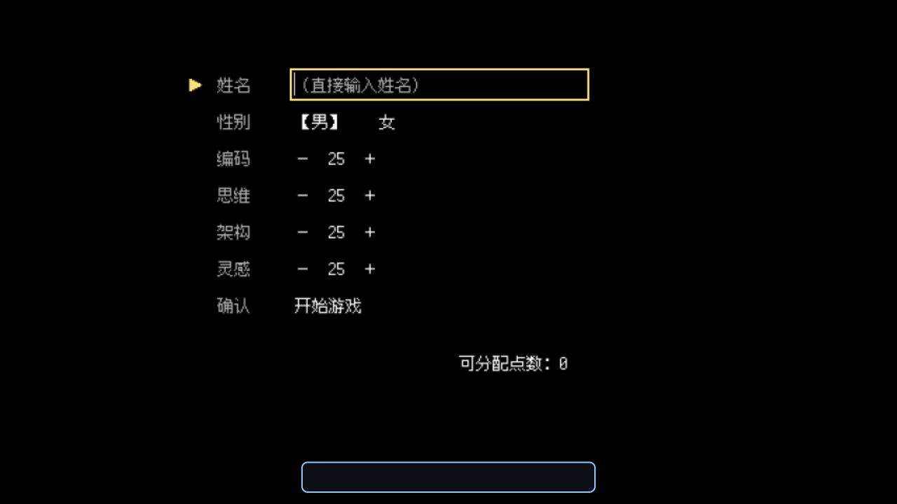
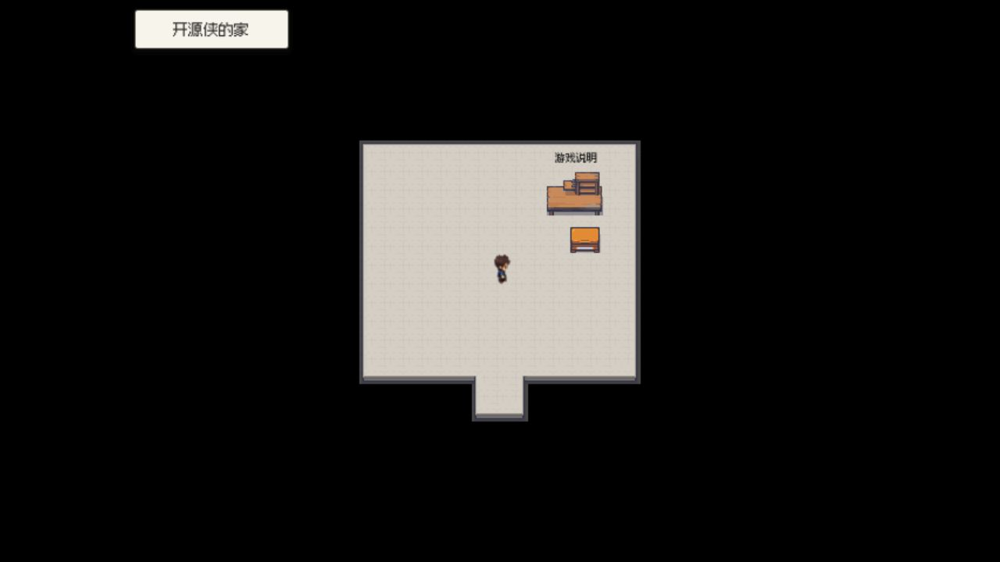
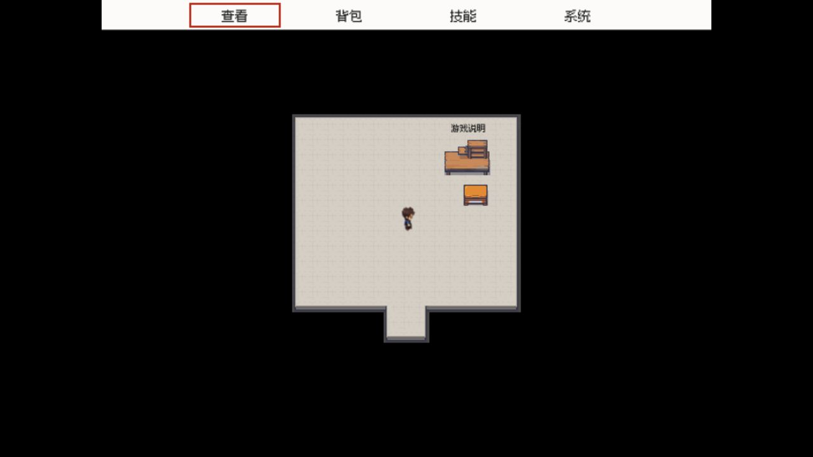

# 前端群侠传


《前端群侠传》是一款使用 Godot 4.7 和 GDScript 开发的 2D 俯视角格子角色扮演游戏。游戏把现代前端技术生态变成了一座江湖：编码、思维、架构和灵感是角色的四项根骨，技术流派化作门派，工程知识则成为可以学习、修炼和用于战斗的功法。

## 故事背景

高考落榜、求职碰壁的你，在网吧门口捡到了一张写着“码界招工”的传单。签下名字后，你被传送到陌生的开源镇，从一名什么都不会的异界开发者开始闯荡。

在这里，你会遇见形形色色的江湖人物，探索以前端技术命名的地区与门派，并逐渐决定自己要走哪一条技术之道。

## 游戏玩法

游戏以探索、成长和战斗为核心：

- 在格子地图中探索开源镇及周边区域，与人物、建筑和地图事件互动。
- 完成固定任务、环任务与动态目标，获得金钱、潜能和物品奖励。
- 拜入 NG 神教、香草派、鱿鱼山庄、量子仙宗等门派，向不同师父学习功法。
- 通过学习、练功和冥想提升实力，搭配基础功法与门派高级功法。
- 与江湖人物切磋或进行生死战，使用攻击、防御、恢复和门派绝招。
- 管理饥饿、口渴、体力、精力与伤势，通过交易、装备和消耗品维持冒险。
- 使用赛博传送往返已经发现的区域，并通过游戏内菜单保存进度。



创建角色时可选择姓名、性别，并在编码、思维、架构、灵感四项属性之间分配点数。不同属性会影响战斗表现、生存能力和技能成长。

## 游戏画面



地图采用 16×16 像素图块，并在运行时直接加载 Tiled 的 TMX 地图与 TSX 图块集。



菜单提供角色查看、背包、技能与系统功能。技能菜单包含冥想、练功、加力和功法，系统菜单则提供传送、恢复、疗伤、保存与退出。

## 操作方式

| 操作 | 键盘 | 移动端 |
| --- | --- | --- |
| 移动或选择 | 方向键 | 屏幕方向键 |
| 确认、互动 | 空格 | 确认按钮 |
| 打开或返回菜单 | Esc | 取消按钮 |
| 战斗选项 | 方向键 + 空格 | 方向键 + 确认按钮 |

移动端会显示虚拟按键，并请求横屏运行。Web 版输入角色姓名后，按回车完成姓名输入。

## 运行项目

需要 Godot 4.7。使用 Godot 打开仓库根目录下的 `project.godot`，然后运行项目即可。

macOS 也可以在仓库根目录执行：

```sh
/Applications/Godot.app/Contents/MacOS/Godot --path . --editor
```

构建 Web 版本：

```sh
npm install
npm run build:web
```

构建结果会生成到 `dist/web/`。项目还配置了 Web、macOS、Windows Desktop 和 Android 导出预设。

## 项目资料

- [游戏与开发文档](docs/README.md)
- [世界与玩法设定](docs/lore_bible.md)
- [代码与存档规范](docs/code_and_save_standards.md)

当前版本：`0.7.7`
